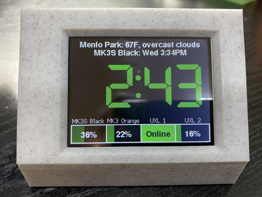
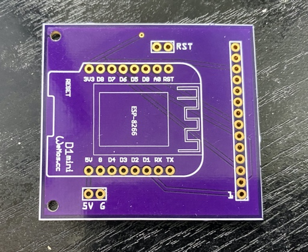
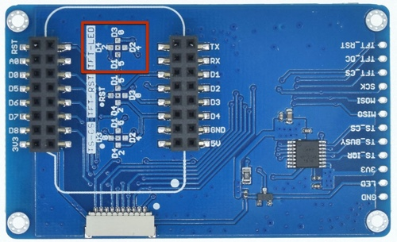
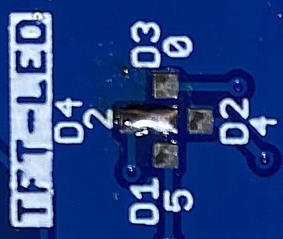
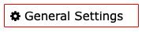
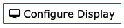
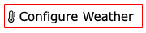
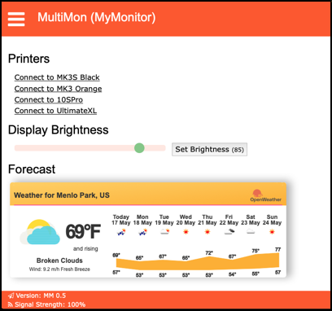
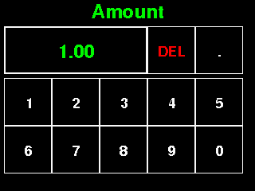
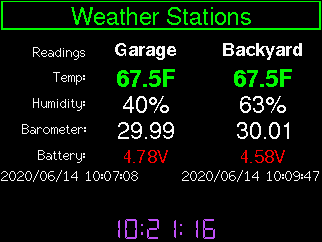

# WebThingApp


A library for building apps based on the [WebThing library](https://github.com/jpasqua/WebThing). In this context, the word app is used somewhat loosely. What we're really talking about is a [`WebThing`](https://github.com/jpasqua/WebThing) with a touchscreen display as opposed to a standalone `WebThing` such as an [air quality monitor](https://github.com/jpasqua/PurpleHaze) or a weather station. 

The goal of the library is to do most of the work of handling the Web UI, GUI, settings management, and plugins, so the "app" can focus on the core functionality it is providing. 
<hr style='clear:left'></div>
Here's an example of a `WebThingApp` called [MultiMon](https://github.com/jpasqua/MultiMon). It monitors up to 4 3D printers as well as providing time and weather information. In the case of [MultiMon](https://github.com/jpasqua/MultiMon), that means it can focus on 3D Printer functionality and leave (most of) the rest to `WebThingApp`. The library comes with a simple demo application called `CurrencyMon` which will be mentioned again below and has it's own [documentation](examples/CurrencyMon/README.md). 



This document is divided into three major parts:

1. [How to build a WebThingApp](#building): Start here if you are building an existing app; e.g., one you found on [github](github.com) or the example app that comes with `WebThingApp`.
2. [How to configure your device](#preparation): Once your device is built and the software is loaded, you'll need to configure it via the Web UI.
3. [How to create or modify a WebThingApp](#creating): Start here if you want to create your own app or modify an existing one. You'll need to understand the `WebThingApp` framework to do so.

<a name="building"></a>
# Part 1: Building a WebThingApp

To illustrate the process of building a WebThingApp we will focus on an example: *CurrencyMon*. This example demonstrates of all of the elements of a `WebThingApp` (hardware and software).

`WebThingApp` has been built and tested with Arduino IDE 1.8.10 and ESP8266 cores 2.6.1 and 2.7.1. Newer versions are likely to work, but I haven't tried other specific combinations. If you have never built an Arduino project using an ESP8266, you'll need to [prepare your development environment](https://github.com/esp8266/Arduino#installing-with-boards-manager). `WebThingApp` also supports the ESP32, though it has less testing to date. It requires v1.0.5rc2 or later of the ESP32 Arduino core.

The general build process is:

1. [Prepare your hardware](#hardware): You only need to do this once.
2. [Download required libraries](#libs): You only need to do this once unless you later want to get a newer version of one of the libraries.
3. [Configure the graphics library](#tft_espi): You only need to do this once unless you change your display or the way it is connected.
4. [Upload the data files](#upload): Do this every time your supporting files change. If you are using an existing app, you should only need to do this once. If you are developing your own app you may need to do this multiple times as you refine and debug your application.
5. [Build and upload the application](#upload): Do this every time your supporting files change. If you are using an existing app, you should only need to do this once. If you are developing your own app you may need to do this multiple times as you refine and debug your application.


<a name="hardware"></a>
## Hardware
`WebThingApp` requires an ESP8266 or ESP32 and a 320x240 touch screen display. For example, a [Wemos D1 Mini](https://docs.wemos.cc/en/latest/d1/d1_mini.html) and a [Wemos D1 Mini 2.4" TFT Shield](https://docs.wemos.cc/en/latest/d1_mini_shiled/tft_2_4.html). They are a nice combination since they require no soldering and only 1 mounting point (the display). However, it should work with virtually any ESP8266/ESP32 with sufficient storage space and any 320x240 screen with an ILI9341 display controller and an XPT2046 touch screen controller. The ESP32 version of the D1 Mini form factor also works wells with `WebThingApp`.

You may wish to provide a physical reset button. If you are using the adapter board, simply solder two wires to the `RST` pads of the adapter board and connect the other end of the wires to a momentary push button.

If you'd like a larger display, `WebThingApp` has also been tested with the 2.8" and 3.2" variants of [this one](https://www.aliexpress.com/item/32960934541.html). Both versions of this display have a single 14-pin header that can be conveniently attached to the D1 Mini using this [adapter board](https://oshpark.com/shared_projects/IhMOtfQC).




### Controlling the brightness of the display

`WebthingApp` can set the brightness of the attached display using a PWM-capable pin on your ESP8266/ESP32. Connect that pin to the brightness pin of the display and specify which pin you used by defining `TFT_LED` in the configuration file for the [graphics library](#tft_espi). 

On the D1 Mini TFT Shield you choose which pin to use by creating a solder bridge as shown in the images below which connects the brightness input to pin D4 of the D1 Mini.

The first image shows the back side of the TFT Shield and the jumper area is marked in red. The second is a closeup of the are in red which show the solder bridge.




<a name="enclosure"></a>
### Enclosure
I've uploaded two models to [thingiverse](thingiverse.com) that may be useful for the D1 Mini Shield hardware:

1. [2.4" TFT Modular Enclosure](https://www.thingiverse.com/thing:4393857)  
2. [Slanted box for 2.4Inch TFT](https://www.thingiverse.com/thing:4413894)

I have also upload [another model](https://www.thingiverse.com/thing:4460344) for use with a 3.2" display.


<a name="software"></a>
## Software

### Dependencies

<a name="libs"></a>
#### Libraries
The following third party libraries are used by WebThingApp. You'll need to download them and place them in your Arduino `library` folder before you build the project.

* [Arduino-Log](https://github.com/thijse/Arduino-Log)
* [ArduinoJson](https://github.com/bblanchon/ArduinoJson): Minimum version: 6.15
* [ESPTemplateProcessor](https://github.com/jpasqua/ESPTemplateProcessor) [0.0.2 or later for ESP32]
* [TFT\_eSPI](https://github.com/Bodmer/TFT_eSPI): Minimum version 2.2.7
* [TimeLib](https://github.com/PaulStoffregen/Time.git)
* [JSONService](https://github.com/jpasqua/JSONService) [v0.0.2 or later for ESP32]
* [WebThing](https://github.com/jpasqua/WebThing) [0.2.0 or later. v0.2.1 or later for ESP32]
* [WiFiManager](https://github.com/tzapu/WiFiManager)
* ESP32 Only
	* [ESP32_AnalogWrite](https://github.com/ERROPiX/ESP32_AnalogWrite)

The following libraries are used in the browser - you do not need to download or install them. They are listed here because if you are doing further development of the browser code, you may need to understand their usage:

* [JSON Form](https://github.com/jsonform/jsonform)

#### Services
The following services are used by `WebThingApp`. You will need to obtain a free API key for each using the provided links:

 - [OpenWeatherMap.org](https://openweathermap.org/appid): Provides weather data for your city.
 - Services used by [WebThing](https://github.com/jpasqua/WebThing)
	 - [Google Maps](https://developers.google.com/maps/documentation): Used for geocoding and reverse geocoding. Though not absolutely necessary, it does make using the system a bit more convenient. *Note* that this functionality is only used by the client code - not code running on the device.
	 - [TimeZoneDB](https://timezonedb.com): Used to get local time and time zone data.

<a name="tft_espi"></a>
#### Configuring the graphics library: `TFT_eSPI`

All of the graphics, text, and images displayed by `WebThingApp` are drawn using the `TFT_eSPI` library. In order to function properly, it needs to know how your display is physically connected to your ESP8266/ESP32. You specify this by providing a  file (a `.h` file). `WebThingApp` provides the following predefined *user setups* which you can use:

| Microcontroller | Display                                   | File                     |
|-----------------|-------------------------------------------|--------------------------|
| ESP8266 D1 Mini | 2.4" D1 Mini Shield                       | D1Mini_ILI9341.h         |
|                 | 2.4", 2.8", 3.2" Display w/ daughterboard | D1_DB_Mini_ILI9341.h     |
| ESP32 D1 Mini   | 2.4" D1 Mini Shield                       | ESP32D1Mini_ILI9341.h    |
|                 | 2.4", 2.8", 3.2" Display w/ daughterboard | ESP32D1Mini_DB_ILI9341.h |

To use one of these, just copy the files listed below into the `TFT_eSPI` directory and uncomment the corresponding line in `User_Setup_Select.h`.

* `WebThingApp/resources/TFT_eSPI/User_Setup_Select.h` &rarr;<br> &nbsp;&nbsp;`library/TFT_eSPI` 
	+ *Notes*:
		+ This will overwrite the file in the destination, so you may wish to save the original.
		+ OR, instead of overwriting this file, simply edit it to add new lines for the setups listed below. This will ensure that the User_Setup_Select.h most closely matches the version of the library you are using.
* `WebThingApp/resources/TFT_eSPI/User_Setups/D1Mini_ILI9341.h`  &rarr; <br> &nbsp;&nbsp;`library/TFT_eSPI/User_Setups/D1Mini_ILI9341.h`
* `WebThingApp/resources/TFT_eSPI/User_Setups/D1_DB_Mini_ILI9341.h`  &rarr; <br> &nbsp;&nbsp;`library/TFT_eSPI/User_Setups/D1_DB_Mini_ILI9341.h`
* `WebThingApp/resources/TFT_eSPI/User_Setups/ESP32D1Mini_DB_ILI9341.h`  &rarr;<br> &nbsp;&nbsp; `library/TFT_eSPI/User_Setups/ESP32D1Mini_DB_ILI9341.h`

### The build process

Building the software for a `WebThingApp` like `CurrencyMon` is a bit more complex than a typical application. You build an upload your app as usual, but you also need to upload support files (such as HTML templates) to your ESP8266/ESP32 using a plugin to the Arduino IDE. The support files need to be in a subfolder of your app named `data` which has this structure:

````
data
├── <HTML files that are specific to your app>
├── plugins <Optional plugin descriptor files>
├── wt <These files come with the WebThing library>
└── wta <These files come with the WebThingApp library>
````
<a name="upload"></a>
Follow these steps to upload the data to your device:

1. Download and install the [`ESP8266 Sketch Data Upload`](https://github.com/esp8266/arduino-esp8266fs-plugin) plugin. For ESP32, use the [ESP32 Sketch Data Upload plugin](https://github.com/me-no-dev/arduino-esp32fs-plugin) plugin. Note that installing this plugin is not the same as installing a normal Arduino library. Follow the installation instructions [here](https://github.com/esp8266/arduino-esp8266fs-plugin#installation). If you have installed successfully, you will see a new menu item in the Arduino IDE Tools menu. See the screen shot below.
2. Prepare the data directory
	* Copy or link the `WebThing/data/wt` directory to the `CurrencyMon/data` directory.
	* Copy or link the `WebThingApp/data/wta` directory to the `CurrencyMon/data` directory.
	* When you're done you'll have a `data` directory that has the structure shown below.
3. You need to reserve some flash memory space for the file system.
	* ESP8266: In the Tools menu of the Arduino IDE you will see a `Flash Size` submenu. Choose `FS: 1MB`.
	* ESP32: For the moment this project is too big to fit in the default program space on the ESP32. Future optimization may change that. For now you must use the `Tools -> Partition Scheme` menu item to select a choice that provides more program space. I use `No OTA (Large APP)`
4. Now connect your ESP8266 to your computer via USB and select the `ESP8266 Sketch Data Upload` item from the tools menu. You will see all the files in your `data` directory, including those in the `wt` and `wta` subdirectories being loaded onto your ESP. The process is the same for ESP32, though the specific names/menu items will be different.
5. Finally you can proceed as usual and compile / upload *CurrencyMon* to your ESP8266/ESP32.


<a name="upload"></a>
#### Upload
Now is the easy part: just compile and upload your app as usual using the `Sketch->Upload` menu item. Once uploaded you will need to configure your application settings using the Web UI.
<br><br>

-----

<a name="preparation"></a>
## Part 2: Setting up your device

Now that your device is up and running, you'll need to configure it using the Web UI. But before you get started, you will need API keys for the services mentioned above (Google Maps, TimezoneDB, and OpenWeatherMap). All are free. Please go to each site, create a key, and keep track of them. You'll need to supply them during the configuration process. You'll also need any API keys which are required for a specific application. For example, in the CurrencyMon sample app, you need a key from [exchangeratesapi.io](exchangeratesapi.io).


<a name="connecting-to-your-network"></a>
## Connecting to your network

Now it's time to get connected to your WiFi network. When your device boots it will create its own WiFi access point. You'll need to connect to it from your computer, smartphone, or tablet. Search for a WiFi network named something like `APP-nnnnnn`. Your app-specific documentation will tell you what name to look for. Once you do, you will enter a "captive portal" where you can configure your device to use your WiFi base station. When you've done that, the device will restart and connect to your WiFi base station.

At this point you will need to connect to your device using a web browser to configure various settings. You can connect using either an IP address or a hostname. You can find the IP address and the default host name on the Utility Screen. You can typically get to the Utility screen by pressing and holding the Home Screen for 3 seconds. Your app documentation will provide details. Once you have your ip address or host name, type it into a browser's address bar and you will be greeted by a Web UI. Now it's time to configure your device.

<a name="configuring-multimon"></a>
## Configuring your device

Once connected, you can use the web interface to configure and change settings including how information is displayed, the weather configuration, and more. You get to the settings by selecting an item from the [hamburger menu](https://en.wikipedia.org/wiki/Hamburger_button) in the top left of the web page. The image in the [Home Page](#home-page) section illustrates the overall structure of all of common pages. Before getting to settings that are specific to your app, you need to configure some general information for your web-connected device including a username / password. You do this using the [General Settings](#general-settings) menu item.

**Note**: If you have mounted your display in an enclosure in a way that is upside-down relative to the default configuration, your image will be upside down until you get around to the [Configure Display](#configure-display) menu. This isn't a problem since the configuration will be happening in the Web UI, not on the display, but if it bothers you, you can skip to that step to flip the display orientation and then come back here.

<a name="general-settings"></a>
  
These settings are common to many network connected devices and are encapsulated by the [*WebThing*](https://github.com/jpasqua/WebThing) library. The settings you must configure are listed below in the order you will want to enter them on a new device. In general, once you have entered the General Settings once, you won't need to change them again. When you are setting up your device for the first time, you will need to enter some of the settings, save, and reboot before you can enter the rest. In particular, you'll need to enter the API keys before you can geolocate your address.

* API Keys: You need these keys to be entered in order to use the location options below and to have the time set.
	* [Google Maps](https://developers.google.com/maps/documentation/javascript/get-api-key): Fill in the api key you acquired from for the Google Maps service
	* [TimeZoneDB](https://timezonedb.com/api): Fill in the api key you acquired from for the TimezoneDB service. Note: NTP is perhaps a more natural choice for a time service, but it does not incorporate a mechanism for time zone determination. TimeZoneDB allows WebThing to get the time, time zone, and local time without need for another mechanism. **Note** that these keys will not be active until after you have saved them and rebooted the device.
* Username / Password: The username / password you'll use when you connect to your device. This is not the same as any username/password you use to log into your printers. It defaults to admin/password. ***You should change these right away***.
* Web Server Settings:
	* Hostname: A network name for your device. If you configure a name such as `MyMonitor`, then you can access your device from a browser using the address `http://MyMonitor.local` rather than using the IP address. This only works on systems that have support for mDNS. This is native on Macs but can be added to Linux and Windows with software such as [Avahi](https://github.com/lathiat/avahi).
	* Port: The port that your device will listen on. Usually 80 unless you've got a good reason.
* Location Settings: Location settings are used to determine the proper time zone. Some apps may also take advantage of this infomration for additional purposes. Note that the "weather city" is specifid separately.
	* Latitude, Longitude, Elevation: Used to determine your time zone. For this purpose elevation is not important, but specific use cases may require it.
	* Address / Geocode: Since you probably don't know your lat/lon and elevation by heart, enter an address in the Address field and press the Geocode button. Assuming you have already saved your Google Maps API key, the address will be translated to lat/lon and elevation. If you prefer not to create a Google Maps key, you can find your lat/lon manually as [described here](https://support.google.com/maps/answer/18539?co=GENIE.Platform%3DDesktop&hl=en).
* Theme Color: Choose a theme for the Web UI that suits your style. The themes are all from the [W3.CSS](https://www.w3schools.com/w3css/w3css_color_themes.asp) set.

<a name="configure-display"></a>
  
Use this menu to configure aspects of the GUI - both how information is displayed and control of the display hardware. Your device will operate with defaults for these settings, but your display may be upside down! The specific settings are described below:

* Enable Schedules: You can set morning/evening schedules that control the brightness of the display.
	* To enable the schedules, click the checkbox.
	* Next, fill in the time at which Morning and Evening begin using the format HH:MM in 24 hour format. That is, 10:30PM would be 22:30.
	* Finally, fill in the brightness (between 1 and 100) for the display for Morning and Evening.
	* Note that the scheduled brightness can be overridden at any time from the [home page](#home-page) or from the GUI.
- Use 24 Hour Clock: Controls the display format of times in the GUI (10:30PM vs 22:30)
- Flip display orientation: Depending on how your hardware was mounted, your display may have been installed "upside down". If you see the image inverted, check this box.

<a name="weather-settings"></a>
  
Use this menu item to configure weather settings. Data for current weather conditions and the forecast are provided by OpenWeatherMap.org. If you are not interested in having the weather data or getting a key from OpenWeatherMap.org, you can disable this functionality. Simply uncheck the box labeled "Get Weather Data from OpenWeatherMap.org".

The rest of the settings are as follows:

- OpenWeatherMap API Key: The key you acquired for the OpenWeatherMap service
- City ID: OpenWeatherMaps identifies cities with a numeric code. Enter the code for your city. You can obtain the code [here](https://openweathermap.org/find).
- Nickname: A nickname for your weather city (e.g. Home)
- Weather Language: Language used for weather descriptions (e.g. Clouds, Mist, Rain)
- Use Metric: Use metric or imperial units in the interface

<a name="configure-plugins"></a>
  
Use this menu item to configure the settings for any loaded plugins. The settings will vary completely depending on the type of plugin. You may be asked to configure things like API keys, refresh times, or names of devices. Each configured plugin will have a separate section on the page with its own "Save" button. Hitting save will save the settings, but not leave the page as you may have other changes you'd like to make. An example of a plugin configuration page is shown below.


<a name="home-page"></a>
## Home Page

The Home Page for your device will depend on the specific application. Refer to the app's documenation for details. This example (see below for screen shot) contains three primary elements.

1. **Display Brightness**: A brightness slider that reflects the brightness of the display when the page was loaded. You can move the slider and click the `Set Brightness` button to change the screen brightness. That level will stay in effect until you change it again, a [schedule is executed](#configure-display), or the device is rebooted.
2. **Forecast**: An OpenWeatherMap banner with the 5-day forecast for the [configured weather city](weather-settings).



<a name="dev-info"></a>
## Operational Info for Developers

Though it is not normally part of the main menu, you can get to an additional page of options by entering the url `http://[Device_Address]/dev` into your browser. The dev page is app specific, but there is a default page which is described here. To add a menu item for the dev page, bring up the page manually once and click the "Show dev menu" option.

<a name="get-settings"></a>
**Viewing your settings**

It can sometimes be useful to see all the settings in their JSON representation. The `/dev` page has a `View Settings` button which will return a page with the JSON representation of the settings. You can also get to this page directly with the url `http://[Device_Adress]/dev/settings`. If you save these settings as a file named `settings.json` and place it in your `data` directory, it can be uploaded to your device using the `Sketch Data Uploader`. There is no need to do this, but developers may find it useful to easily switch between batches of settings.

The `/dev` page also has a `View WebThing Settings` button which will return a page with the JSON representation of the WebThing settings. This includes things such as the hostname, API keys, and the web color scheme.

**Screenshots**

You can get a screen shot of whatever is currently displayed on the device using the `Take a screen shot` button. This will display an image in your browser which corresponds to the current content of the display. You can also get to this page directly with the url `http://[Device_Adress]/dev/screenShot`.

**Rebooting**

Finally, the `/dev` page also has a `Request Reboot` button. If you press the button you will be presented with a popup in your browser asking if you are sure. If you confirm, your device will go to a "Reboot Screen" that displays a red reboot button and a green cancel button. The user must press and hold the reboot button for 1 second to confirm a reboot. Pressing cancel will resume normal operation. Pressing no button for 1 minute will behave as if the cancel button was pressed.
<br><br>

-----

<a name="creating"></a>
# Part 3: Creating your own WebThingApp

The easiest way, by far, to create a new WebThingApp is to start from an existing one like `CurrencyMonApp` which is provided as an example. You can also start with other instances of `WebThingApp` on github such as [MultiMon](http://github.com/jpasqua/MultiMon) or [GrillMon](http://github.com/jpasqua/GrillMon). Look at the main concepts below and start customizing the app as needed.

## Main Concepts and Components

When creating a new `WebThingApp` there are five primary elements you'll need to provide or customize:

1. An **app** object: 
  + This will be a subclass of `WTApp`. More precisely, it will be a subclass of `WTAppImpl` which itself is a subclass of `WTApp`.
  + This is a singleton which is exported into the global namespace as  `WTApp* wtApp` and is thereby available to all parts of the application.
  + When accessing the wtApp, you may need to downcast it to your derived type; e.g. `(CurrencyMonApp*)`.
2. A **settings** object
  + App-specifc settings (if any) are stored in an object which is a subclass of `WTSettings`.
  + The latter handles all the settings that are common to all `WebThingApp`'s. Your subclass just needs to handle app-specific settings.
  + A pointer to the settings object is stored in `WTApp`. To get your app-specific settings, you'll need to downcast it to your derived type; e.g. `SDSettings`.
3. **Custom screens** in the GUI (optional). For example, you would probably want to have you're own home screen that focuses on the main data of interest for your use case.
4. **Custom pages** in the Web UI (optional). You may wish to have a custom home page, and if you have app-specific settings, you'll want to give the user a way of viewing and changing them via a page in the WebUI.
5. **Custom code** for managing any app-specific tasks or communicating with other devices/services (optional).

Looking a little deeper, we have:

* **[WebThing](https://github.com/jpasqua/WebThing)**: WebThing is a generic ESP8266/ESP32 framework for building *things* with a web configuration capability. They are called *things* as in Internet of *Things*. This library provides core functionality such as connecting to WiFi, saving and retreiving settings from the file system, and a Web UI capability that handles core configuration tasks as well as providing a framework for additional Web UI functionality.
* **Settings**: Information that is typically provided by the user to customize the operation of `WebThing`, `WebThingApp`, and any Plugins. These are stored in three separate files, though the developer doesn't really need to think about that.
* **DataBroker**: A rudimentary, but extensible, mechanism that allows data providers to publish information that other parts of the application can consume.
* **Display**: At the lowest layer we have the Display namespace.
	* It is primarily a shim on top of the [TFT_eSPI](https://github.com/Bodmer/TFT_eSPI) library which provides all of the graphics functionality.
	* It provides lower level functions such as setting the screen brightness, and calibarating the touch panel.
	* It also provides a wrapper over the TFT_eSPI font mechansim to reduce memory consumption.
* **Screen**: Above that we have the `Screen` class and a number of common subclasses.
	* A `Screen` instance displays information and handles user input. For example, there is a `WeatherScreen` that provides weather information based on data from [OpenWeatherMap.org](https://openweathermap.org).
	* The `Screen` instances provided in this library may be used by an application or not depending on their applicability.
	* Applications may create their own sublclasses of `Screen` to provide application-specific functionality and UI.
* **ScreenMgr**: As the name implies, ScreenMgr manages multiple screens that are used as part of an application.
	* It keeps track of all registered screens.
	* It is used by the application or other `Screen` instances to cause a screen to be displayed; For example, `ScreenMgr::display(weatherScreen)`
	* It provides other utlity functions related to screen management
* **Plugin**: A Plugin is a way of extending a `WebThingApp` in a low-code or no-code manner. Plugins use JSON files to define:
	* Their settings
	* A Web UI to adjust the settings 
	* A Screen to display information in a custom layout. The data to be displayed is given by keys that are looked up via the `DataBroker`.
	* Basic identifying information for the Plugin
* **App**: App objects hold the state of the application and provide the functions used in the main loop. Specific App sublasses, such as CurrencyMonApp, provide app-specific functionality such as monitoring printers and publishing printer-related data to the Data broker.

## File / directory structure for the `WebThingApp` library

The library is structured as follows:

````
WebThingApp
├── README.md
├── data
│   └── wta
│       ├── ConfigDev.html
│       ├── ConfigDisplay.html
│       ├── ConfigPlugins.html
│       ├── ConfigWeather.html
│       └── HomePage.html
├── doc
└── src
    ├── WTApp.[h,cpp]
    ├── WTAppImpl.[h,cpp]
    ├── WTAppSettings.[h,cpp]
    ├── WebUIHelper.[h,cpp]
    ├── clients
    │   ├── BlynkClient.[h,cpp]
    │   ├── CoinbaseClient.[h,cpp]
    │   └──  OWMClient.[h,cpp]
    ├── gui
    │   ├── Button.[h,cpp]
    │   ├── ...
    │   ├── UIOptions.[h,cpp]
    │   └── fonts
    │       └── ...
    ├── plugins
    │   ├── Plugin.[h,cpp]
    │   ├── PluginMgr.[h,cpp]
    │   └── common
    │       ├── BlynkPlugin.[h,cpp]
    │       ├── CryptoPlugin.[h,cpp]
    │       └── GenericPlugin.[h,cpp]
    └── screens
        ├── CalibrationScreen.[h,cpp]
        ├── ...
        ├── WiFiScreen.[h,cpp]
        └── images
            └── ...

````

Description:

* **`WebThingApp`**: The root directory houses the implementation of the app infrastructure:
  * **`WTApp`**: The base class for apps. It is really a data class providing the common data used by all apps.
  * **`WTAppImpl`**: A subclass of `WTApp` that provides most of the app logic and structure. It is subclassed by apps like `CurrencyMon` to provide app-specific functionality.
  * **`WTAppSettings`**: Contains the data and code to manage the common settings used by all apps. It is subclassed by apps like `CurrencyMon` to provide app-specific settings.
  * **`WebUIHelper`**: A set of functions and data that build on the Web UI provided by `WebThing` to provide Web UI functions that are common to most apps. This is not a class, it is a namespace. Apps like `CurrencyMon` will use WebUIHelper to provide most of their WebUI and then add endpoints for app-specific functionality.
* **`clients`**: This directory contains code that implements client objects for web services, sensors, or other data providers/actuators that are common to many `WebThingApps`. Of course applications can use existing libraries if they exist or define their own.
* **`data`**: This directory contains one subdirectory: `wta`. It contains the HTML files that correspond to the pages that will be served by `WebUIHelper`. The `wta` directory should be copied into (or linked to) the applications data directory.
* **`gui`**: This directory has the definitions and implementations for core GUI elements such as `Display`, `Screen`, `ScreenMgr` and `Theme`. The common screens included in the library, as well as any app-specific screens, are built on the GUI elements.
* **`plugins`**: This directory contains the both the implementation of the Plugin mechanism and a subdirectory containing a number of standard plugins that may be used by `WebThingApps`.
* **`screens`**: This directory contains the definition and implementation of a number of common Screens that are likely to be used by many `WebThingApps`. The list of common screens is defined [below](#common_screens).
	
## File Structure for an example App


Please take a moment to review [the structure of a sample application](examples/CurrencyMon/README.md#structure), CurrencyMon, to learn what the major components are and where to find them.

<a name="screens"></a>
# Screens

There are conceptually three types of screens you need to be aware of:

1. Common screens that are provided by `WebThingApp`: For example, there is a weather forecast screen and a screen that lets the user perform calibration of the touch screen.
2. **Custom screens that are implemented by your app**: You will probably have at least one custom screen (typically the home screen), that sets your app apart.
3. `FlexScreens` whose layout and data sources are given in JSON files and do not require custom code.

This section describes each.

<a name="common_screens"></a>
## Common `Screen` Subclasses

This library ships with the following `Screen` subclasses which can be used without modification.

* `CalibrationScreen`: Provides a process for the user to calibrate the touch screen. The application would typically want to save the calibration data, so it can provide a change-listener callback which will be invoked by `CalibrationScreen` any time the process is completed.
* `ConfigScreen`: When a WebThing comes online for the first time it typically has no WiFi connection information and must be configured by the user. If this is the case, the app may display the `ConfigScreen` to instruct the user to do so.
* `EnterNumberScreen`: Displays a number pad that allows the user to enter numerical data.
	* This screen is a bit different from the others in that it is a bit more interactive. Most screens just accept simple button presses. This screen does that too, but the buttons represent a numeric input "pad" that allows the user to enter numbers that can be used by the app.
	* 
	* The buttons function as follows:
		* Value Button: In the upper left, there is a value button which displays the current value. To accept the value you have entered, press the value button. That will pass the value back to the app.
		* To the left of the value button is a "DEL" button. It deletes the rightmost digit of the value. Press and hold "DEL" for a second and it will clear the entire value.
		* To the left of the "DEL" button a "." button *may* be displayed. It is only visible if the application is asking for a value that can contain decimals.
		* To the left of the "." button a "+/-" button *may* be displayed. Pressing it negates the current value. It is only displayed if the application allows negative values.
		* [0-9]: Append the specified digit to the end of the current value
* `ForecastScreen`: Provides a 5-day forecast based on data from [OpenWeatherMap.org](https://openweathermap.org). It is typically used in conjunction with `WeatherScreen`.
* `RebootScreen`: Some `WebThing` applications may provide expert or developer interfaces. These may wish to invoke a `RebootScreen` which asks the user to confirm a reboot and upon confirmation, reboots the device.
* `UtilityScreen`: This screen provides information about the "thing" such as the name, version number, the web address, and the wifi signal strength. It also provides buttons that can be used to:
  * Jump directly to a named plugin screen (up to 4)
  * Adjust the screen brightness
  * Ask the application to refresh data from whatever sources it is monitoring
  * Enter the touch screen calibration process (see CalibrationScreen).
  * Return tot he home screen.
* `WeatherScreen`: Provides current weather information based on data from [OpenWeatherMap.org](https://openweathermap.org). It is typically used in conjunction with `ForecastScreen `.
* `WiFiScreen`: During the startup process of a `WebThing`, one of the earliest steps is to connect to WiFi. This screen can be displayed to tell the user that the connection is being established.
  * **NOTE**: There are two available images that can be used by this Screen. One is 16 bits per pixel and consumes ~80KB and the other is 1bpp and consumes only ~5KB. The first looks nicer, but takes a lot of space. To use the smaller image and thereby save space space for other code/data, be sure to uncomment the line `#define WiFiLogo_UseMono` in `WiFiLogon.h`. By default, it is defined on ESP8266 and not defined on ESP32.

All of these screens are loaded by default. If you want to exclude one of them to save space, you'll need to remove it from `WTAppImpl::registerScreens()`. This amounts to commenting out two lines: the declaration and the instantiation.

## Creating new subclasses of `Screen`

The `Screen` class has three functions that you need to write in your subclass:

* The constructor: Do whatever setup is necessary for your object. If your Screen has button areas that can be touched by the user to trigger an activity, this is where you would typically define them.
* The `display()` function: This is the heart of the `Screen`. It is responsible for displaying all data and graphics.
	* It can optimize the redrawing of elements as it sees fit based on whether information has changed, *unless* the `force` parameter is set in which case it must redraw the entire screen. This happens, for example, when the user moves from one screen to another.
	* This function will use the [TFT_eSPI](https://github.com/Bodmer/TFT_eSPI) library to actually draw the visual elements. Please refer to the documentation for that library to learn how to use it. You can also look at the common `Screen` subclasses as examples.
* The `processPeriodActivity()` function: A `Screen` may be static or it may need to be updated periodically. When a `Screen` is being displayed, the `processPeriodActivity` function will be called each time through the Arduino loop. The function can decide if it is time to refresh part or all of the `Screen` and act accordingly. For example, if the `Screen` is display a clock with seconds, it could update each second. For a clock with minutes it would update each minute. For a `Screen` that displays stock market information, it would only update if new information has been retrieved.
* The `ButtonCallback`: If you defined buttons in your constructor you will provide a callback which is invoked if the button is touched. It decides what to do. A trivial example is a **Home** button. When the user touches the button, your callback should invoke `ScreenMgr` and request that the home screen be displayed.

## Plugins and FlexScreen

WebThing applications can be extended using the plugin mechanism ([see below](#plugins)). A plugin can define a `Screen` without new code using the `FlexScreen` mechanism, which:

 * Creates a `Screen` based on a definition given in a JSON document
 * That document specifies the layout of the elements on the screen and the data that should be used to fill those elements
 * The data is accessed via the `WebThing DataBroker`. The JSON document provides the keys to be used and `FlexScreen` uses the `DataBroker` to get values associated with the keys at runtime.
 * There is only one user interaction defined for a `FlexScreen`. Touching anywhere on the display invokes the `ButtonDelegate` supplied when the `FlexScreen` is instantiated.

So, a developer need never use `FlexScreen` directly. The `Plugin` system will use it as needed if plugins are loaded.

<a name="plugins"></a>
# Plugins

## Overview

As mentioned above, `WebThingApp` contains a simple Plugin system which supports expansion and customization in a no-code or low-code manner. Without any code a plugin can add a new screen to the GUI which presents existing information (e.g. weather data or grill status) information in a custom layout. With code, plugins may also add new data sources (e.g. readings from a locally attached sensor or data gathered from a REST API). For example, you may want a screen that contains a specific set of information in a specific layout that suits your needs. `WebThingApp` ships with an example plugin that you can use to help create your own.

Plugins are largely declarative, using JSON files to describe the GUI they present on the attached display, their settings, the Web form to display/edit the settings, and references to the data they consume. 

You can have many instances of the same type of plugin or of different types of plugin. At the moment, `WebThingApp` allows up to four plugins but this is a somewhat arbitrary limit. More could be added if memory allows.

***NOTE***: This document is just as nascent as the Plugin system itself. Looking at the examples will be required to understand the mechanism.

### Dependencies
The Web UI page used to display plugin settings is based on [JSON Form](https://github.com/jsonform/jsonform). It has a number of dependencies on various CSS and Javascript files.
You do not need to install these files - they are just used in the browser. None of this is used directly by `WebThingApp`. This list is provided for information only.

* [JSON Form](https://github.com/jsonform/jsonform)
* [JQuery](https://github.com/jquery/jquery)
* [Underscore.js](https://github.com/jashkenas/underscore)
* [Bootstrap](https://github.com/twbs/bootstrap) (CSS file only): `WebThingApp` uses a customized version which allows pages generated by [JSON Form](https://github.com/jsonform/jsonform) to coexist with the [W3.CSS](https://www.w3schools.com/w3css/defaulT.asp) styles used elsewhere in the Web UI. The custom CSS file is hosted [here](https://jpasqua.github.io/static/bootstrap-3.3.7-iso.css) and is version 3.3.7.

## Structure of Plugins

A plugin consists of four of JSON descriptors described below, and optionally C++ code for any deeper customizations. To create a no-code plugin (called a Generic plugin), only the JSON files are needed.

<a name="descriptors"></a>
### JSON Descriptors

Each plugin requires four JSON descriptor files. All descriptors for a plugin are placed in a subdirectory of `/data/plugins` which can have any name you'd like. The directory name is not germane to the plugin. The four JSON files are listed below and must have these names:

* **plugin.json**: A simple file which gives:
  * The display name of the plugin
  * The plugin type. The type must either be "generic" for no-code plugins, or must correspond to a name you've given in your custom code.
  * A namespace. If this plugin makes data available to other plugins, the namespace is used to reference it. See the section on [data values](#datavalues).
* **settings.json**: If the plugin has settings, for example an API key for a REST service it uses, they are given in this file. This is very much like the main `WebThingApp` settings file, but the contents are up to the plugin developer. For generic (no-code) plugins, there are just a few settings:
	* Whether the plugin is enabled
	* How often to refresh the UI
	* A representation of the units of the refresh interval (i.e. is it seconds, minutes, etc.)
* **form.json**: A [jsonform](https://github.com/jsonform/jsonform) descriptor that is used by the Web UI to allow the user to display and edit the settings. Using this mechanism, a plugin can augment a `WebThingApp`'s Web UI without creating a new HTML template or writing custom code. The Web UI for all plugins are displayed by the [Configure Plugins](../Readme.md#configure-plugins) page 
* **screen.json**: A description of the layout and content of the screen. The FlexScreen class is responsible for parsing this description and displaying information - no custom code is required. FlexScreen can display things like floats, ints, and string using a format you specify. It can also display more complex things like a progress/status bar. At the moment, that's the only complex thing.

### Custom Code

You can create a plugin that goes beyond what is possible via a generic plugin. There are two types of code that may be involved in a custom plugin: the plugin itself and one or more data sources:

* **The plugin code**: The plugin code is a subclass of the built-in Plugin class. It is typically fairly simple and is responsible for a few things:
  * Serializing and Deserializing any custom settings from the settings.json file. This is fairly mechanical and can be copied and customized from one of the example plugins.
  * Mapping names to values. When you are describing your screen layout in the screen.json file, each field has a key. That key is a string that names the data value to be displayed. It is up to the plugin code to handle requests to map keys to actual values. For example, a key might be "headline" and the plugin might map that to a value from a news source which provides top headlines.
* **Data sources**: A data source is any code that makes data available for use by one or more plugins. This could be something that reads information from local sensors, a remote device, a news service - whatever. It is responsible for getting the data and providing an API for consuming it.

Plugin code should be placed in the `src/plugins` directory and the data sources should be placed  in the `src/clients` directory.

To make a new type of plugin available, you must add it to the `PluginFactory` which is typically defined in your main app. A `PluginFactory` simply takes a plugin name, as defined in a plugin.json file, and returns an instance of that plugin. See the sample code for details. 

## Describing the GUI Layout

A major part of the plugin is the screen it displays in the GUI. This is defined in the `screen.json` file. The overall structure is:

````
{
  "items": [ { }, ... { } ],
  "bkg": "0x000000",
  "name": "Displayed Name"
}
````
The bulk of the content is in the `items` array, each element of which describes an item that is displayed on the screen. I sometimes refer to this as a field. An item may be static content, like a label, or it may be a reference to some value. Before going into the details of items, there are two other simple elements:

* `bkg`: Provide the background color of the screen as a 24bit hex color code
* `name`: The name that will be used to identify the plugin in the GUI and Web UI. This should be a fairly short name as space is limited in the GUI.

The `items` have a number of elements, some of which are optional:

````
{
  "x": 86,  "y": 35,
  "w": 117,  "h": 26,
  "xOff": 58, "yOff": 13,
  "justify": "MC",
  "font": "SB9",
  "color": "0xFFFFFF",
  "format": "%s",
  "strokeWidth": 2
  "type": "STRING",
  "key": "stress"
}
````

The elements are as follows:

* `x, y, w, h`: *Required*. These provide the size and location of the field on the display. The location (0, 0) represents the upper left corner of the display. Note that displayed values are not clipped to the bounding box defined by `w, h`. 
* `xOff, yOff	`: *Optional*. Gives the offset within the bounding box where the content will be rendered. If not specified, it will default to (0, 0).
* `justify`: *Optional*. Defines the alignment of the displayed content within the field. For example, if you would like the content to be centered horizontally and vertical within the field's bounding box, then set `(xOff, yOff)` to `(width/2, height/2)` and use `MC` as the `justify` value.
  
  Allowed values are:
  * TL: Top Left
  * TC: Top Center
  * TR: Top Right
  * ML: Middle Left
  * MC: Middle Center
  * MR: Middle Left
  * BL: Bottom Left
  * BC: Bottom Center
  * BR: Bottom Right

  If not specified, it will default to `TL`. 
* `font`: *Optional*. The font to be used. The structure of the names are: `Family` `Style` `Size`. The families are Mono (M), SansSerif (S), Digital (D). The styles are Regular (default), Bold (B), Oblique (O), and Bold-Oblique (BO). The allowed values are:
  * M9, MB9, MO9, MBO9: 9 point Mono fonts in all styles
  * S9, SB9, SO9, SBO9: point Sans fonts in all styles
  * S12, SB12, SO12, SBO12: 12 point Sans fonts in all styles
  * S18, SB18, SO18, SBO18: 18 point Sans fonts in all styles
  * S24, SB24, SO24, SBO24: 24 point Sans fonts in all styles
  * D20, D72, D100: 7-Segment Digital Font in large sizes
  
  `font` may also be a number corresponding to a built-in font in the [TFT\_eSPI](https://github.com/Bodmer/TFT_eSPI). If this item is omitted, it defaults to built-in font 2.
* `color`: *Required*. The color of the content of the field. This is a 24-bit (888) hex color specifier (not a name) which begins with `0x`.
* `format`: *Required*. The format is used to display the content of the field. It is a `printf` style format. For example if the field is meant to display a temperature, then the format might be: `"Temp: %0.1fF"`. If the field is just a static label, then the format specifies the label. Note: while optional, if this is not supplied, then no content will be displayed other than a border if specified.   The `format` must correspond to the `type`. For example, if the `type` is `FLOAT`, then the `format` must include some variation of `%f`. 
  
  There are special values of the format string that begin with '#'. These format strings indicate that a a custom display element should be used rather than displaying the result textually. The current set of custom display elements are:
  * `#progress`: Display a progress bar.
* `strokeWidth`: *Optional*. If supplied it specifies the size of a border to be drawn around (inside of) the bounding box. If not supplied, then no border will be drawn.
* `type`: *Optional*. Specifies the type of the value to be displayed in the field.
  * Allowed values are: `INT`, `FLOAT`, `STRING`, `BOOL`.
  * All of the previous types refer to single values. There are a few pre-defined types which are composite values:
      * `CLOCK`: This is a composite of three INT values representing an hour, minute, and second. A value of this type should be used with a format such as `%2d:%02d:%02d`, which would display the hour, minute, and seconds. You could also use `%2d:%02d`, which would display only the hour and minute.
      * `STATUS`: This composite type consists of an `INT` and a `STRING`. For example they might be a status code and a message. The associated format must have the `%s` for the message before the `%d` for the code. For example: `"Error %s (%d)"`.
      * A value of this type may also be used in conjunction with the `#progress` format which will display a progress bar.
* `key`: The name of a data value that should be supplied by the Plugin framework when the screen is displayed. Allowed values are defined by the custom Plugin code ***or*** a system value may be used (see [below](#datavalues)). For example, a custom Plugin that reads sensor data might have a value called "stress". This name may be used as a key.

<a name="datavalues"></a>
## Data Values

Any plugin (generic or custom) may access values made available by an app-wide data broker. Values are provided by a number of built-in sources, but can also be provided by plugins and their associated data providers.  For example, the Blynk Weather plugin example makes all of its data available to other plugins.

Values have names that are composed of multiple parts. All keys begin with a '$' followed by a single letter:

* `$S`: Corresponds to the system namespace which contains keys for things like the current time and heap statistics
* `$G`: Corresponds to the Grill namespace which contains keys related to the grill being monitored such as the status of the grill and the requested grill temperature.
* `$W`: Corresponds to the weather namespace which contains keys such as the temperature in the selected city.
* `$E`: Corresponds to the ***extension*** namespace which is where plugins can publish their own data values.

The list of available values for `$S`, `$P`, and `$W` are given in the table below.


| Full name | Type 	  | Description	|
|-----------|:-------:|------------	|
| **System**    |         |	             |
| `$S.author` | STRING  | GrillMon's author                 |
| `$S.heap`   | STRING  | Heap free space and fragmentation |
| `$S.time`   | CLOCK   | The current time |
| **Weather**   |   | |
| `$W.temp`   | FLOAT   | Current temperature |
| `$W.desc`   | STRING  | Short description of weather conditions  |
| `$W.ldesc`  | STRING  | Longer description of weather conditions |
| **Grill**   |   | Note that if *GrillMon* is not connected to a grill, the values below will not be meaningful. |
| `$G.connected`  | BOOL | Indicates whether GrillMon is connected to a grill |
| `$G.id`  | STRING | The ID of the connected grill. |
| `$G.fv`  | STRING | The firmware version of the connected grill. |
| `$G.state`  | STRING | The state of the connected grill: On, Off, or Fan. |
| `$G.fireState`  | STRING | The state of the flame of the connected grill. For example `Starting` or `Running` |
| `$G.warning`  | STRING | A representation of the current warning. If there is no warning (which is normal), it will be "None" |
| `$G.dft`  | INT | The desired food temperature. |
| `$G.cft`  | INT | The current food temperature. |
| `$G.dgt`  | INT | The desired grill temperature. |
| `$G.cgt`  | INT | The current grill temperature. |
| `$G.foodTemps`  | STRING | A formatted version of the food temperatures in the form `Current / Desired` |
| `$G.grillTemps`  | STRING | A formatted version of the grill temperatures in the form `Current / Desired` |

Any plugin that publishes data should provide a similar list of available data. See the [Blynk Weather Plugin](#bwp) for an example.


## Plugin Examples

`WebThingApp` provides several plugins that may be used (or not) by specific apps. All of the JSON descriptor files for these plugins are in the `data/plugins/` directory, but the settings files are named `sample.json` rather than `settings.json`. Simple rename the `sample.json` to `settings.json` if you want to use it (without the proper name, the plugin won't be loaded).

<a name="bwp"></a>
### The Blynk Weather Plugin

The Blynk Weather Plugin is an example of a custom plugin that provides a new data source and custom plugin code. The new data source gets data from the [Blynk](https://blynk.io) service. In this example a weather station such as [JAWS](https://github.com/jpasqua/JAWS) writes readings like temperature and humidity to the Blynk service. The Blynk Weather plugin collects data from up to two weather stations and displays the information in a new screen:



This plugin consists of the following files:

* `BlynkClient.[cpp,h]`: The client code that reads data from the Blynk service that was written there by a weather station. Though BlynkClient is used by the BlynkWeather plugin, it can also be used by any plugin that wants to read arbitrary information from Blynk.
* `BlynkPlugin.[cpp,h]`: The custom plugin code that manages settings and maps names to values. 
* `data/plugins/blynk1/*.json`: The JSON plugin descriptors as [described above](#descriptors).

This plugin has a number of settings that need to be specified by the user such as the Blynk IDs associated with the two weather stations and nicknames for each station that will be displayed in the GUI. The `form.json` file describes the web form that will be used to present the settings to the user. [jsonform](https://github.com/jsonform/jsonform) is a very rich tool that is well described on github. Please refer to its [wiki](https://github.com/jsonform/jsonform/wiki) to learn more.

To use this plugin you would have to have a a weather system that publishes data out to Blynk. However, the plugin can be easily adapted to other sensor data that is available through the Blynk service.

This plugin also acts a data source for other plugins. All of the data it retrieves from Blynk can be accessed through the [DataBroker](#datavalues). The plugin uses the `BW` namespace, so to access Blynk Virtual pin 0 on device 0, the full key would be `$E.BW.0/V0`:

* `$E.` means this is a request for data from an extension data source (i.e. a plugin)
* `BW.` means get it from the plugin whose namespace was declared to be `BW`
* `0/V0` means Blynk device 0, virtual pin 0. For this example, that is the temperature reading.

The full set of available data is:

| Full name | Type 	  | Description	|
|-----------|:-------:|------------	|
| `$E.BW.NN1`  | STRING  | The nickname for the first Blynk device      |
| `$E.BW.NN2`  | STRING  | The nickname for the second Blynk device     |
| `$E.BW.0/V0` | FLOAT   | The temp reading from the first Blynk device |
| `$E.BW.0/V1` | FLOAT   | The humidity reading from the first Blynk device |
| `$E.BW.0/V2` | FLOAT   | The barometer reading from the first Blynk device |
| `$E.BW.0/V7` | FLOAT   | The battery reading from the first Blynk device |
| `$E.BW.0/V8` | STRING  | The formatted time of the most recent readings from the first Blynk device |
|  | **NOTE**  | All of the same readings are available for the second Blynk device. Just replace the leading 0 with a 1. For example, `$E.BW.0/V1` &rarr; `$E.BW.1/V1` |

### The Generic Plugin

The generic plugin shows how to create a custom screen with your own layout that displays existing data from the [system or any other plugin](#datavalues). In this case, there is no code - just the JSON descriptor files.


Some things to notice in the descriptor files:

* **plugin.json**:
  * The name specified here is the display name. It gets used by `UtilityScreen` to label a button. It is also used in the [plugin settings page](404) in the Web UI.
  * The type is "generic" which tells the system that this is a generic plugin rather than one that requires custom code.
* **screen.json**: The screen layout has examples of left, right, and center-justifying fields. It uses different fonts, different sizes, and different colors. It pulls data from the system namespace, the grill namespace, the weather namespace, and from the Blynk plugin. If you're not using that plugin you can remove those fields. It also uses the `CLOCK` type.
* **settings.json**: Generic plugins have four elements in their settings file. Only two are visible to the user:
  * `version`: *Not user visible*. This is the version of the settings structure. It is used internally by the system.
  * `enabled`: *User visible*. Is the plugin enabled? That is, will the user be able to select this plugin in the GUI. 
  * `refreshInterval`: *User visible*. How often the GUI should be updated.
  * `riScale`: *Not User Visible*. The units of `refreshInterval`. Internally all refresh times are represented in milliseconds. If you want the user to operate in seconds, then `riScale` should be 1000 (1000 millis in a second). If you want the user to set values in minutes, then `riScale` should be 60*1000.
* **form.json**: This file describes how the settings should be displayed to the user in the Web UI. A couple of points of interest here:
  * The version setting is not listed at all since it is not sent from the browser to the app.
  * The `riScale` field is sent to the server, but the user doesn't see it, so it is declared as hidden.

# Limitations, innefficiencies, oddities, etc.

There are numerous limitations and innefficiencies in this library and [WebThing](https://github.com/jpasqua/WebThing) overall. As they occur to me, I will list them here.

* Bound to one display type. At the moment this library assumes a specific display type which is 320x240 pixels and has a touch screen. The underlying TFT_eSPI library has more flexibility and so could this library.
* Support for OpenWeatherMap and weather screens is built in at a fairly low level. This should be optional and modular, including the settings, Web UI configuration, and inclusion of the associated screens.
* There should be a type of plugin with no screen.
	* It would simply be a data provider (based on one or more clients) with settings and a Web UI for configuration.
	* If that were the case, then the OpenWeatherMap stuff would just be a plugin rather than being built-in
* DataBroker can only provide String results which limits its utility.
	*  For example, it would be nice if all (or at least most) Screens could be implemented solely based on data from the DataBroker rather than having hard linkages to client code.
	*  The same is true for the Web UI. It should be able to get all of it's data from the DataBroker. 
