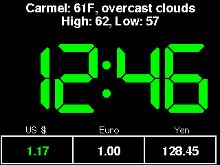

# CurrencyMon: A WebThingApp Example




*CurrencyMon* is a simple example application based on the [WebThingApp library](https://github.com/jpasqua/WebThingApp), which itself is based on the [WebThing library](https://github.com/jpasqua/WebThing) library. To understand how those libraries work in more detail, refer to their documentation.

*CurrencyMon* uses the `exchangeratesapi.io` service to get currency exchange rates for up to 3 currencies. It allows the user to enter an amount of one currency and see the corresponding amounts in the other currencies.
 

This application demonstrates the following:

* The framework to follow to create new apps
* How to create and use persistent settings for your app
* Screens
	* How to use screens that come with WebThingApp
	* How to create custom screens
	* How to get numeric input from the user
* Clients
	* How to use clients that come with WebThingApp
	* How to create custom clients
* How to use the plugin framework

## Dependencies

### Libraries

To build this application you will need to douwnload and install all of the libraries required by [WebThingApp library](https://github.com/jpasqua/WebThingApp) and [WebThing library](https://github.com/jpasqua/WebThing). No additional libraries are required.

### Services

*CurrencyMon* depends on two services in addition to those used by [WebThingApp library](https://github.com/jpasqua/WebThingApp) and [WebThing library](https://github.com/jpasqua/WebThing):

* **exchangeratesapi.io**:
	* This service requires a free API key. You can get one [here](https://manage.exchangeratesapi.io/signup).
	* If you don't want to get an API key, you can get mock values by entering MOCK as the api key in the settings. 
* **coinbase.com**:
	* This service is used by the plugin example. It does not require an API key, but does use SSL.
	* To remove the plugins completely, just delete (or move) the `plugins` directory from the `data` directory (see the file structure below).
	* If you wish to keep the plugins but don't have enough memory, you can use a mock client which returns fabricated results. Mocking can be enabled in the `CoinbaseClient.h` file. As you will seeing, mocking is enabled by default on ESP8266.

<a name="structure"></a>
## File Structure 

Let's look at the files and directory structure of a typical `WebThingApp`. In this case the app is called `CurrencyMon` and files often have the prefix `CM`. Here is an overview of the directory structure.

````
CurrencyMon
├── CMDataSupplier.[h,cpp]
├── CMSettings.[h,cpp]
├── CMWebUI.[h,cpp]
├── CurrencyMon.ino
├── CurrencyMonApp.[h,cpp]
├── README.md
├── data
│   ├── <html files that are specific to this app>
│   ├── plugins
│   │   ├── 1_gnrc
│   │   ├── 3_crypto
│   └── wt
│   │   └── <html files from the WebThing library>
│   └── wta
│       └── <html files from the WebThingApp library>
└── src
    ├── clients
    │   └── RateClient
    └── screens
        ├── AppTheme.h
        ├── SplashScreen.[h,cpp]
        ├── HomeScreen.[h,cpp]
        └── images
            └── ...
````

Description:

* The `CurrencyMon` directory contains the source code for the app itself:

	* `CMDataSupplier `: This module contains a dataSupplier function which gets plugged into the `DataBroker` to publish app specific information. In this case it is information about exhcange rates.
	* `CMSettings `: Defines, internalizes, and externalizes the settings that are specific to this app.
	* `CMWebUI`: Provides app-specific web pages and functions. For example, the configuration page that lets you specify which currencies you are. interested in. `WebThingApp` provides many other pages such as general settings, display settings, and weather settings.
	* `CurrencyMon.ino`: This is a bridge between the Arduino `setup()` and `loop()` functions and the app initialization and operation. It is boilerplate and there is no app-specific code in this module.
	* `CurrencyMonApp`: This is the core of the application. It is a subclass of `WTAppImpl` and `WTApp` which are part of the `WebThingApp` library.
* The `data` directory contains contains all the files that will be written to the file system as part of the build process. There are four sets of files in the data directory:

	* At the root are HTML files that are used by any custom pages served up by the app's Web UI. For example, a custom home page. You may also place a settings.json file here if you want to have settings loaded into the app by default. Otherwise the user will need to configure the app settings when the device starts the first time.
	* The `plugins` subdirectory contains subdirectories for each plugin to be loaded. See the [plugin section](#plugins) for details.
	* The `wt` subdirectory contains HTML for the pages displayed by the `WebThing` Web UI pages. These are low level configuration items such as the hostname to use. You may also place a settings.json file here if you want to have settings loaded into the app by default. Otherwise the user will need to configure all the `WebThings` settings when the device starts the first time.
	* The `wta` subdirectory contains HTML for the pages displayed by the `WebUIHelper`. These are pages that are common to most apps like a page to configure display settings.

* The `src/clients` directory contains code that implements client objects for web services, sensors, or other data providers/actuators. Of course applications can use existing libraries if they exist. This directory is for app-specific clients.

* The `src/screens` directory contains code for app-specific screens. Most apps will use the common screens provided by `WebThingApp`, but they will also typically provide at least one custom screen.

## Building and Using CurrencyMon

To build *CurrencyMon*, follow the instructions in the ["Building a WebThingApp"](../../README.md#building) section of the `WebThingApp` documention. This covers both the hardware and software aspects of the build process.

Once complete, you can set up your device following the instructions in the ["Setting up your device"](../../README.md#preparation) section. This will get you 90% of the way through the process, but you still need to configure settings that are specific to *CurrencyMon*.

### Configuring the Currencies

### Configuring the Plugins